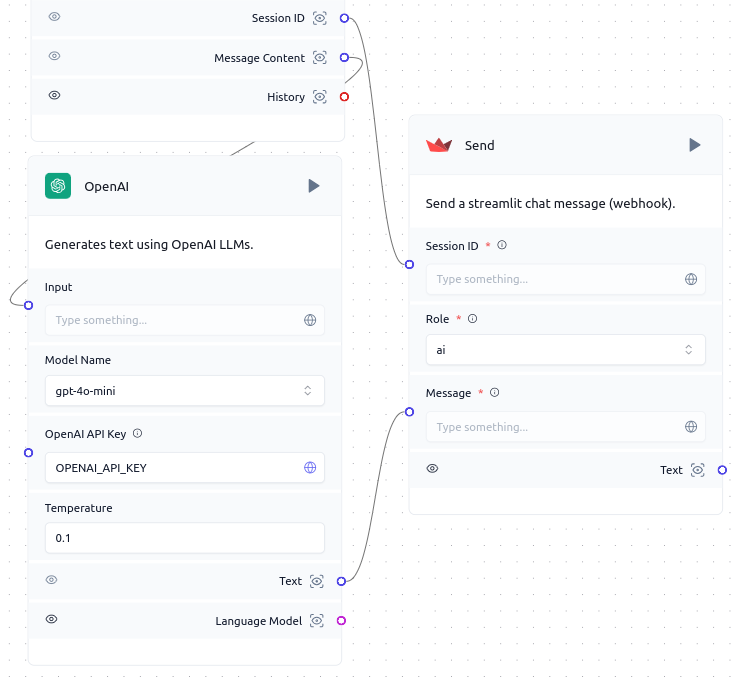

# Send

Langflow enhances its functionality with custom components like `Send`. This component sends messages to the specified session of a self hosted Streamlit application.

## Prerequisites

1. **Setting up a Streamlit App**: Follow the guide [Setting up a Streamlit App](./setup) to set up a Streamlit application in your workspace.

## Component Functionality

<Admonition type="tip" title="Component Functionality">

The `Send` component allows you to:

- Sends message to specific streamlit chat session.

</Admonition>

## Component Usage

To incorporate the `Send` component into a Langflow flow:

1. **Add the `Send` component** to your flow.
2. **Configure the component** by providing:
   - `SessionId`: The ID of the session you want to interact with.
   - `Role`: The role that will be used to send the message.
3. **Connect the component** to other nodes in your flow as needed.
4. **Initiate the flow** to begin retrieving the messages of session from a Streamlit server.

## Code Block for the `Send` Component

```python
from langflow.custom import Component
from langflow.schema.message import Message
from langflow.inputs import MessageTextInput, DropdownInput, NestedDictInput, IntInput, StrInput, BoolInput
from json import loads, dumps


class Send(Component):
    display_name = "Send"
    description = "Send a streamlit chat message (webhook)."
    icon = "Streamlit"

    inputs = [
        MessageTextInput(
            name="session_id",
            display_name="Session ID",
            info="Session ID of streamlit. For each browser tab that connects to the Streamlit server, a new session is created.",
            placeholder="Enter the session ID",
            value="",
            required=True
        ),
        DropdownInput(
            name="role",
            display_name="Role",
            options=["ai", "user"],
            info="Message sender role.",
            placeholder="Enter the message sender role.",
            value="ai",
            required=True
        ),
        MessageTextInput(
            name="message",
            display_name="Message",
            info="Content of the message that will be sent.",
            value="",
            required=True
        ),
        NestedDictInput(
            name="tweaks",
            display_name="Tweaks",
            info="The tweaks can be used to modify the flow's parameters and components.",
            value={},
            required=True,
            advanced=True
        ),
        IntInput(
            name="port",
            display_name="Port",
            info="Streamlit API Port",
            value=7881,
            required=True,
            advanced=True
        ),
        StrInput(
            name="hostname",
            display_name="hostname",
            info="IP or hostname of Streamlit API",
            value="localhost",
            required=True,
            advanced=True
        ),
        BoolInput(
            name="rerun",
            display_name="Rerun Flow",
            info="If True, run the current flow again",
            value=True,
            required=True,
            advanced=True
        )
    ]

    outputs = [
        Output(display_name="Text", name="text", method="text_response"),
    ]


    async def text_response(self) -> Message:
        import requests
        flow_id = self.vertex.graph.flow_id
        resp = requests.post(f"http://{self.hostname}:{self.port}/api/v1/sessions/{self.session_id}/messages", json={"role": self.role, "content": self.message})
        if resp.status_code == 200:
            self.rerun and await self.run_flow(
                inputs={"input_value": ""}, flow_id=flow_id, tweaks=self.tweaks
            )
            return Message(text=dumps(loads(resp.content)))
        else:
            raise Exception("Timeout exception")
```

## Example Usage

<Admonition type="info" title="Example Usage">

Example of using the `Send` component in a Langflow flow:



In this example, the `Send` component receives a text message from the `OpenAI` component and the sessionId from the `Listen` component as inputs, then sends the message to the Streamlit chat session.

</Admonition>


## Troubleshooting

<Admonition type="caution" title="Troubleshooting">

If you encounter any issues while using the `Send` component, consider the following:

- Ensure the provided session ID is correct and the Streamlit application is accessible.
- Ensure the provided role is set appropriately.
- Consult the Streamlit Developers APP Page for documentation updates.

</Admonition>
